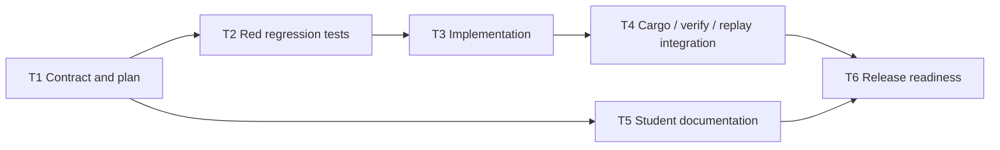

# Bounded console test options

T1 contract, inspected against base `9d2eecca774f932f10d23a2b0df4772223c96554`.
This document specifies the implementation and its task gates; it does not claim
that the feature or its validation has shipped.

## Scope and grammar

Extend only the manual Cargo console's Test action:

```text
cargo test [FILTER] [-- OUTPUT_OPTION]
OUTPUT_OPTION := --nocapture | --no-capture | --show-output
```

The brackets denote optional groups, not literal input. There is at most one
filter and at most one output option. The output option requires the literal
`--` separator and must be the final token. The filter, when present, precedes
that separator. A separator without an output option is rejected.

A filter is a single literal token of 1 through 256 ASCII bytes, inclusive.
Its first byte must not be `-`; every byte must be an ASCII letter, digit, `_`,
`:`, or `-`. No Rust identifier/path parser is needed: `tests::legal_moves`,
`legal_moves`, `tests::`, `1`, and `legal-moves` are valid substring filters.
Even `:` is valid; this grammar does not promise a matching test exists.
Unicode, periods, slashes, whitespace, controls, quotes, escapes, expansion,
and all other punctuation are rejected inside a filter. Empty filters cannot
be expressed through the console and must also fail direct argv validation.
The 256-byte bound keeps filters comfortably below the model's
`MAX_STRING_BYTES = 4096` and the console's 4096-byte whole-line limit.

Keep the parser's existing whole-line rejection of control characters and
shell syntax. Keep existing tokenization: leading, trailing, and repeated ASCII
spaces are accepted within the 4096-byte input limit; tabs and newlines are
control characters and remain rejected. Length checks count input bytes,
including surrounding spaces. Do not introduce shell parsing or quoting.

Accepted examples (the option spellings remain distinct in evidence):

```text
cargo test
cargo test legal_moves
cargo test tests::legal_moves
cargo test -- --nocapture
cargo test -- --no-capture
cargo test -- --show-output
cargo test tests::legal_moves -- --nocapture
cargo test tests::legal_moves -- --no-capture
cargo test tests::legal_moves -- --show-output
```

Rejected examples, each rejected before tool discovery, process launch, or
opening any redirect target:

| Input | Reason |
| --- | --- |
| `cargo test one two` | Multiple filters |
| `cargo test --` | Empty option group |
| `cargo test legal_moves --` | Empty option group |
| `cargo test --nocapture` | Option without separator; leading-dash filter |
| `cargo test -legal_moves` | Leading-dash filter |
| `cargo test -- --nocapture legal_moves` | Filter after separator |
| `cargo test -- legal_moves` | Filter in option position |
| `cargo test -- --nocapture --show-output` | Multiple output options |
| `cargo test -- --nocapture --nocapture` | Repeated output option |
| `cargo test -- -- --show-output` | Repeated separator |
| `cargo test -- --nocapture=true` | Option with value |
| `cargo test -- --exact` | Unapproved libtest option |
| `cargo test -- --ignored` | Unapproved libtest option |
| `cargo test -- --test-threads=1` | Unapproved libtest option |
| `cargo test --locked` | Controller-owned Cargo option |
| `cargo test --release` | Unapproved Cargo option |
| `cargo test --package example` | Unapproved Cargo option |
| `cargo test --manifest-path other/Cargo.toml` | Unapproved Cargo option |
| `cargo test --message-format=json` | Controller-owned output choice |
| `cargo test -- --locked` | Cargo option in libtest position |
| `cargo test legal_moves > out` | Test redirection |
| `cargo test legal_moves < in` | Test redirection |
| `cargo test legal_moves>out` | Attached redirection |
| `cargo test 'legal_moves'` | Quotes |
| `cargo test legal*` | Wildcard |
| `cargo test $(name)` | Shell expansion |
| `cargo test legal_moves; cargo run` | Command chaining |
| `cargo test tests/legal_moves` | Character outside filter allowlist |
| `cargo test légal_moves` | Non-ASCII filter |

Boundary cases are normative: 256 `a` bytes as the filter are accepted; 257 are
rejected. An otherwise valid line padded with ASCII spaces to 4096 bytes is
accepted; at 4097 bytes it is rejected. Direct preparation and model validation
must enforce filter bounds even when no original console line exists.

A filter uses libtest's substring matching over the full test name; it does
not imply `--exact`. `--no-capture` lets tests print while running, potentially
interleaving output. `--nocapture` is its deprecated alias, retained here for
familiar existing usage. `--show-output` displays captured successful-test
output after tests finish. These are harness settings: Rustrace still records
the process's output under its existing limits. See the official
[Cargo test documentation](https://doc.rust-lang.org/cargo/commands/cargo-test.html)
and [libtest options](https://doc.rust-lang.org/rustc/tests/index.html), checked
for this contract through Context7 and the linked Rust documentation.

Bare `cargo test`, the menu Test action, all other console actions, assignment
command policy, environment policy, output/deadline limits, cancellation,
checkpoints, and packaged test cases retain their existing behavior. This
feature adds no arbitrary Cargo/libtest options, Test redirection, integrated
debugger, general argument forwarding, new dependencies, or new settings.

## Preparation and recorded evidence

For all new console forms, set action to Test and leave `stdin`/`stdout` paths
absent. The command route remains Closed stdin and Console stdout. Prepare the
following exact vector, where optional groups disappear when absent:

```text
program: <resolved absolute rustup>
args: ["run", <selected toolchain>, <resolved absolute cargo>,
       "test", "--locked", [FILTER], ["--", OUTPUT_OPTION]]
```

For example, the recorded full vector for the filtered legacy spelling is:

```text
["/trusted/rustup", "run", "pinned", "/trusted/cargo",
 "test", "--locked", "tests::legal_moves", "--", "--nocapture"]
```

`--locked` is controller-owned and occurs exactly once before any filter and
before `--`; it must never reach libtest. Preserve the supplied output-option
spelling and filter exactly. Console output stays natural, with no
`--message-format=json`. Bare console Test remains `test --locked`. Menu Test
continues through `prepare` and the instructor policy, producing its existing
`test --message-format=json --locked` form. Existing instructor locking/offline
normalization remains unchanged; new console arguments do not become permitted
assignment command arguments.

`src/session/command.rs` already obtains the full recorded argv from the
prepared `Command`'s program and arguments. Keep that path: record what is
actually executed, including resolved tool paths and controller arguments, not
the typed line or a reconstructed display command. Do not rewrite stored argv
or add event fields to represent the new options. Keep capture accounting,
finish outcomes, tree links, and evidence validation intact.

## Minimal implementation locations

1. In `crates/model/src/command.rs`, add one small shared predicate for the
   console Test tail **after** `cargo test` (or after recorded `test --locked`).
   It accepts exactly `[]`, `[FILTER]`, `["--", OUTPUT_OPTION]`, and
   `[FILTER, "--", OUTPUT_OPTION]` with the bounds above. A slice of
   `impl AsRef<str>` permits both parser tokens and owned recorded arguments
   without a new command AST or token-copying layer. Keep filter/option checks
   local and name the predicate for this specific policy. The model already
   exports command helpers through `pub use command::*` and supplies shared
   dependency predicates; follow that pattern rather than creating a crate.
2. In `src/cargo_policy.rs::parse_console_command`, keep the whole-line gate
   and use the shared predicate to recognize the Test tail. Preserve literal
   argv in `ConsoleCommand`. In `prepare_console`, revalidate the same tail
   and action prefix; callers can construct this public struct without parsing.
   Keep the existing non-Run redirection rejection.
3. In `prepare_inner`, append the validated literal tail only for natural-output
   console Test, after adding controller `--locked`. Do not append instructor
   tails on the structured-output route or broaden another action. The existing
   parameters suffice; no new session/process abstraction is needed.
4. In `ControlledCommandStarted::validate`, extend the generic non-Run console
   branch only when `action == Test`: accept `--locked` followed by the shared
   predicate's allowed tail. Keep Closed/Console route requirements. Preserve
   the branch's exact historical forms `--frozen`,
   `--message-format=json --locked`, and `--locked` for their existing actions.
   Do not allow the new filter/options after `--frozen` or the historical JSON
   prefix, on Build/Check/Clippy/Doc/Run, or with submitted/file stdin or file
   stdout. Do not tighten or broaden the existing non-console evidence branch;
   assignment execution policy remains in `validate_command`.
5. Update the unsupported-command help text and its existing assertion to show
   the bounded Test syntax and the three option choices. Retain the rest of the
   allowlist. Student-facing prose belongs to T5.

## Compatibility and rollout

Existing `.rta` packages must open and work unchanged, including their existing
manifest Test commands. No package/schema/event format version bump, migration,
repacking, or capability metadata is needed. Historical console and menu
recordings remain readable by the updated reader.

This is not forward-compatible with older readers: their strict console argv
validation rejects recordings using the expanded Test forms, despite unchanged
event structure. Update grader/verifier/replay installations before distributing
the student writer update. Do not silently strip arguments or misclassify a
rejection as corrupt student work. Release notes must state this order and name
the first compatible release once the user chooses it; T6 must not invent a
version, tag, or publish a release.

## Task gates and dependency graph

Each task is an independently reviewed gate. Finish its acceptance criteria
before a dependent task begins; do not divide the work into separate global
planning, coding, and validation phases. T5 may proceed after T1 independently
of T2–T4. The root orchestrator owns integration, publishing decisions, and
resource cleanup; workers retain resources and remain available for fixes until
integration is accepted.



| Task | depends_on | Work and acceptance gate |
| --- | --- | --- |
| T1 | `depends_on: []` | Only this file: exact grammar, bounds, argv, compatibility, minimal implementation, dependency graph, and meaningful validation criteria. Review for an unambiguous implementable contract. No code or prose-mirroring tests. |
| T2 | `depends_on: [T1]` | Add behavioral regressions in `tests/cargo_policy.rs`, `tests/console_session.rs`, and `crates/model/tests/controlled_command.rs`. Demonstrate failures against the base implementation using existing public APIs. Review the failing assertions and their causes before T3. |
| T3 | `depends_on: [T2]` | Implement the narrow shared validation and preparation changes above. Make T2 green without weakening assertions; keep historical, menu, other-action, and assignment behavior. Review the code and green evidence. |
| T4 | `depends_on: [T3]` | Run real Cargo through the production session, preserve actual event/output evidence, and exercise submission verification and replay with unchanged assignment packaging. Add focused integration regressions where current tests do not cover the behavior. Review end-to-end evidence and compatibility. |
| T5 | `depends_on: [T1]` | Update `docs/student-guide.md` and relevant privacy prose for test filters/output and the approved external debugger workflow below. Review examples against this contract and claims against actual recording behavior. No integrated debugger or prose-only tests. |
| T6 | `depends_on: [T4,T5]` | Prepare the PR/release-readiness checklist and summarize validation, limitations, compatibility, and reader-first rollout. Independent final review. No tag, version bump, publish, deployment, or merge; the user merges/releases manually. |

## Behavioral validation criteria

T2 must show red because supported commands currently fail parsing/preparation
or event validation, not because of a missing new helper, compilation failure,
or broken fixture. Include all option spellings with and without a filter,
filter-only and module-path cases, exact prepared argv, invalid forms, and
256/257-byte and 4096/4097-byte boundaries. Exercise manually constructed
`ConsoleCommand` values so parser bypass cannot permit extra arguments,
wrong actions, invalid filters, or redirection. Preserve the existing bare,
menu, dependency, Run, and shell-rejection coverage.

Model regressions must use the public event decoder/validator, accept every
new canonical Test argv, round-trip its exact spelling, preserve historical
forms, and reject malformed tails and invalid routes. Demonstrate that new
options do not become valid for other console actions. A production console
session test must reach command completion, show Closed stdin, and inspect
recorded start/output/finish events; parser-only coverage is insufficient.

T3 runs the affected policy/session and model tests once after implementation;
repeat only for changes, failures, or unresolved concerns. T4 must validate real
libtest behavior with a trusted, dependency-free fixture and a compatible
installed toolchain. Extend the existing real-Cargo patterns in
`tests/controlled_cargo.rs` and/or `tests/cargo_policy.rs` as appropriate:

- Define at least two tests with distinct output markers and observable runs.
  A filter selects only its matching test; an unfiltered run executes both.
  Verify outcomes/counts or fixture effects as well as marker presence.
- Bare Test and filter-only Test keep successful-test prints captured by
  libtest. Each of the three output options exposes the successful-test marker
  in both the live console view and recorded bytes. Do not assert unstable
  timing, cross-stream ordering, or full Cargo progress text.
- Check exact recorded argv, normal completion, Closed/Console routes, unchanged
  source/lockfile bytes for this benign fixture, and existing capture bounds.
  A zero-match filter is valid Cargo behavior, not a parse error.
- Open an unchanged existing-format assignment package, use the expanded console
  command, finalize its recording/submission, and require verification plus
  replay to accept it with matching recorded argv/output and reconstructed
  state. Reuse `tests/verify_cli.rs` and
  `crates/replay/tests/controlled_command.rs` patterns as needed. A real Cargo
  process launched outside `ProductionSession` alone does not satisfy this gate.
- Keep historical recording and menu Test checks. Document the known old-reader
  rejection; never weaken verification to accept arbitrary argv.

New integration regressions introduced in T4 must also demonstrate behavioral
red against the pre-implementation revision in an isolated checkout before
being accepted green. Do not revert shared implementation work to obtain red.
Use focused tests first and the repository's applicable formatting/build/test
checks for final integration; record exact commands and results. Toolchain
unavailability is a reported blocker, not a silently skipped green test.

## T5 external debugger policy and T6 readiness

Students may use a separate debugger on artifacts built by Rustrace. Source
edits stay inside Rustrace. Finish a Rustrace build first, then use the existing
artifact in the external debugger without rebuilding concurrently; stop the
debugger before rebuilding. Rustrace does not record external debugger commands
or output. Program execution under that debugger can still write files, so the
workflow must not promise a read-only run or recorded execution provenance.
These boundaries are approved policy, not a request for a new integrated
debugger, launcher, automatic discovery, or debugger recording feature.

T6's reviewable checklist must cover T2 red/T3 green evidence, real Cargo output
and filtering, verify/replay round-trip, unchanged `.rta` compatibility,
historical forms, student/privacy documentation, and grader/verifier-first
rollout. Record remaining limitations: ASCII-only filters, one option, substring
matching, harness-dependent behavior, and unrecorded external debugging. Leave
all version selection, release actions, and final merge to the user.
